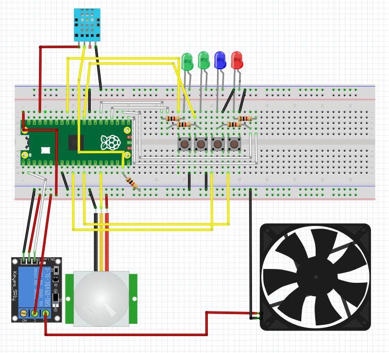
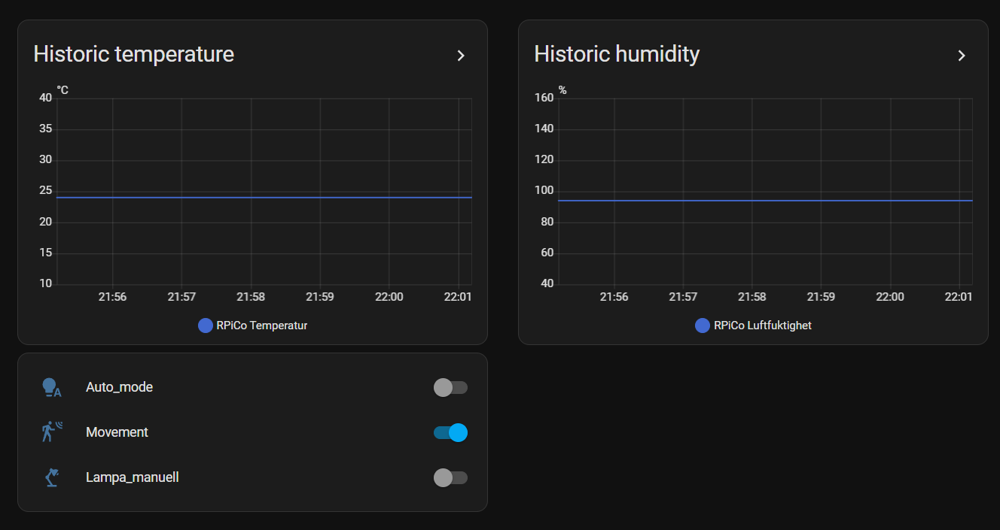
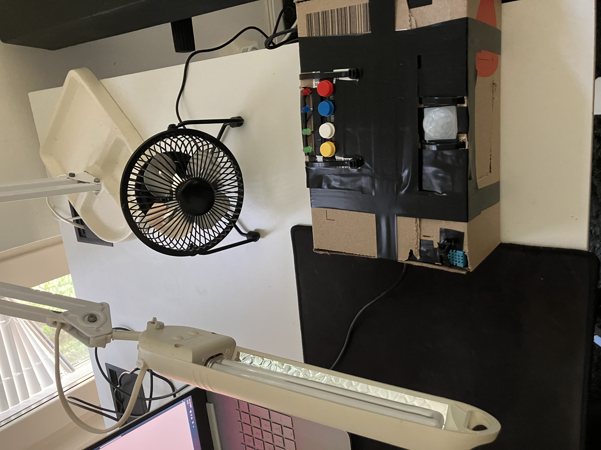

# Automatic desktop Fan and Lighting

## Overview
- **Author**: Jacob Flisberg jf223wh
- **Estimated Time**: ~6–12 hours including circuit setup, Home Assistant setup, and debugging

This project is a smart automation system that controls a lamp and a fan based on motion detection (PIR sensor), user-defined auto/manual modes, temperature (DHT11 sensor), and the position of the sun. The microcontroller used is Raspberry Pi Pico W. The device connects to WiFi and communicates over MQTT with Home Assistant, running on a Raspberry Pi 4, to send data and user inputs. To avoid manually adding WiFi and MQTT credentials in the code, a reset button has been incorporated. When pressed, it starts an access point where you can enter the new credentials via a web page, which are then saved to a .txt file.

---

## Objective

I'm a person who's sensetive to the heat in the summers. On top of that I spend a lot of time at my desk and can often get engrossed in what I'm doing and then forget to turn the light on when it gets dark or to turn the fan off when I'm cooled off. To solve these issues and save some money on electricity I wanted to create a device that could automate these processes for me. The main objectives have been to create a self-contained and WiFi-configurable automation device that:

- Turns on lights and based on motion and time of day and a fan based on temperature and motion
- Allows switching between automatic and manual modes
- Sends temperature, humidity, movement and button data to Home Assistant
- Can be easily reconfigured via a button held at startup

---

## Materials
Items marked with (*) are found in the [LNU starter kit](https://www.electrokit.com/lnu-starter) for a total cheaper price than buying them separately.
| Component            | Use                                               | Notes                                               | Cost (SEK)|
|----------------------|----------------------------------------------------|----------------------------------------------------|----------|
| Raspberry Pi Pico WH*| Main microcontroller |||
| [Raspberry Pi 4](https://www.electrokit.com/raspberry-pi-4-model-b/4gb) | Host for Home Assistant | SD card, ethernet and USB C cable required |729 |
| [Desktop fan](https://www.clasohlson.com/se/USB-fl%C3%A4kt-%C3%98-14-cm/p/36-7879?utm_source=google&utm_medium=cpc&utm_campaign=p-se-pmax-clas-ohlson-feed&utm_id=21897558452&gad_source=1&gad_campaignid=21901444282&gclid=Cj0KCQjw953DBhCyARIsANhIZoZweBzYua1UH_ivY2qNI5sKeyH0RI0M__Bl6UYj-kND_Kk1e2YJAbMaAqCREALw_wcB) | The controlled fan | Basic USB fan |100|
| [PIR Sensor](https://www.electrokit.com/pir-rorelsedetektor-hc-sr501)| Detects motion | 3.3V GPIO, has settings for time delay and sensitivity |55 |
| [Smart plug](https://www.kjell.com/se/produkter/smarta-hem/smarta-hem-losningar/cleverio-smarta-hem/cleverio-smart-fjarrstrombrytare-ip200-med-energimatning-3680-w-p52210?utm_source=google&utm_medium=cpc&utm_campaign=SE%20%7C%20UP%20%2D%20PM%20%7C%20Standard%20Shopping&gad_source=1&gad_campaignid=21060731674&gclid=CjwKCAjwprjDBhBTEiwA1m1d0quBJFERe-orUD-pM_r-tYzPJ_6gP0yBwnWsbymvzQAb0sjrLGhQthoC2ZsQAvD_BwE)|Relay for the light|Set up to wifi with "Tuya" app|139|
| DHT11*|Temperature and humidity sensor|||
| [5V Relay Module](https://www.kjell.com/se/produkter/el-verktyg/elektronik/utvecklingskit/arduino/moduler/luxorparts-relamodul-for-arduino-1x-p87032)|Controls the fan| Cheaper options exist|100|
| Resistors*|For LEDs and pull-up for DHT11 sensor| Four 1kΩ, one 10kΩ||
| LEDs*| Indicators for buttons and wifi-reset mode| Two green, one blue (only yellow in starter kit), one red||
| [Tactile Switches](https://www.electrokit.com/knappar-pcb-sortiment-12st?gad_source=1&gad_campaignid=17338847491&gclid=Cj0KCQjw953DBhCyARIsANhIZoafeAWtfX31QQbni1Q4TaL7jI7SYvFG01E0TW891F5BpbIP6BgtArAaAozBEALw_wcB) | Buttons for reset, manual and automatic contorl | Four, one for each LED|99|
| Breadboard*|To connect all the components|||
| Jumper wires*||||
| [Capacitor](https://www.electrokit.com/x2-kondensator-100nf-275vac-10mm)|Stabiliser for the DHT11 input| One 100nF|12|

The setup will look really messy unless you have something to build it in. I used a cardboard box with electrical tape, but if you have access to a 3D-printer, that would be ideal.

---

## Computer Setup
The microcontroller used in the project is Raspberry Pi Pico W and MicroPython is the language. To develop and test the code I used Thonny, as this was the environment that caused the least troubles for me. The following chapter explains how you flash the firmware to your Pico W, how to set up Thonny and how you can install the relevant files onto your Pico W. I will also explain briefly how to set up Home Assistant and the MQTT addon.    

### Firmware
[This tutorial](https://projects.raspberrypi.org/en/projects/getting-started-with-the-pico/3) explains how to install the firmware in a very straight forward way. The TL;DR is:
- Hold BOOTSEL while plugging the Pico W in → shows `RPI-RP2`
- Download the  latest MicroPython `.uf2`
- Drag into `RPI-RP2`, if it restarts it was successful.

### IDE
My first idea was to use VS code as this is the environment that I'm used to. But since I had problems with connecting the Pico W, I tried Thonny and it worked right away, no extensions needed. Start by installing Thonny and opening it, then:
- Plug in the Pico W
- Go to Tools > Options > Interpreter and choose "MicroPython (RP2040)". Click "Ok" and Thonny will try to automatically find the port after which you're connected to the Pico W.

### Uploading the code
Download the .py files in this repository. If you're connected to the Pico W, you'll see the files inside  it in the panel on the left in Thonny. Do the following:
- Open the code files and choose Files > Save As
- Pick the Pico W in order to upload it 
- The file simple.py is not written by me, but it's a library for MicroPython which didn't work for me with this interpreter. If the same is true for you, you'll need to create a directory "umqtt" in the Pico W and upload simple.py to it.
- If you want to test the code or write something yourself, wait with uploading boot.py. It's a file which runs automatically when the Pico W starts, meaning you won't be able to connect the Pico W to Thonny and see the files inside after it's been uploaded.

If you want to test code you can click the "stop/restart backend" button. When the Pico W is connected, just go to the file you want to test and click "run current script".  

### Home Assistant

To upload the Home Assistant OS to your Raspberry Pi 4, follow [this simple tutorial](https://www.youtube.com/watch?v=OurlX5w7W8c). To set up the MQTT broker:
- Go into Settings > Add-ons > Add-on store
- Search for "Mosquitto broker" and download that add-on
- Create a new user in Home Assistant by going to Setting > People > Add person. Call it something like "IoT_user".
- Remember the username and password for this user. These credentials are needed later.
- Go to Settings > Devices & services > Integrations
- Go into the MQTT add-on and click configure
- Under "Topic to subscribe to" write "home/rpico/#"

This is all the setup needed to communicate with Home Assistant, but you will also need to create some automations for the light. I go more into this under "The Code". One very useful add-on to also have is "Studio Code Server". With it, you can see and edit the configuration files inside Home Assistant.

To use the smart plug to Home Assistant you first have to connect it to your wifi. Do this by:
- Downloading the app "Tuya"
- Put the plug in a socket and press the button until it starts blinking
- Connect to it in the app
- In Home Assistant go to Settings > Devices & Services > Integrations > Add integration
- Search for Tuya and you will get a QR code that you can read in the Tuya app to connect the smart plug

---

## Putting everything together
This section shows how the circuit should be set up and also some electrical calculations to motivate the choice of resistors.

### Circuit setup


The setup in the photo does not include the USB A to micro B cable which is connected to the Pico W. It also doesn't show that the outer insulation of the wire from the fan was cut only three cm at the end. I tried to avoid making it messy looking without changing how any of the connections actually were on the breadboard. 
The wires are colored as following:
- Black: ground
- Red: Power supply
- Yellow: Signal going into the Pico W
- White: Signal coming out of the Pico W

Note that the power wire to the DHT11 is 3.3V, whereas the power wire to the relay, the fan and the PIR-sensor are connected to the VBUS, 5V. The tactile switches in the center of the breadboard only give a signal when pressed down, the switch mechanic happens in the code. The resistors from the Pico W pins to the LED anodes are all 1kΩ. The resistor from the signal of the DHT11 to ground is 10kΩ and stabilizes the received signal from the sensor. The DHT11 is in reality on a circuit board with three pins, but just look at the manual if you're unsure of which pin is which. 

### Electrical calculations

The GPIO pins deliver a voltage of 3.3V. The forward voltages of the LEDs I used are:

|LED color|Forward voltage (V)|
|---------|-------------------|
|Red      |2.0                |
|Green    |2.2                |
|Blue     |3.0                |

With Ohms law and the resistance 1000Ω, this corresponds to the following currents:

$$ I_{R}=\frac{3.3-2.0}{1000}=1.3 mA$$
$$ I_{G}=\frac{3.3-2.2}{1000}=1.1 mA$$
$$ I_{B}=\frac{3.3-3.0}{1000}=0.3 mA$$

These currents are definitely safe for the LED. If you find that the LEDs (particularly the blue one) are too dim, use a resistance of 220Ω-330Ω.

---

## Platform
This section goes into Home Assistant, why I chose it and how you can use it to present your data.

### Home assistant 
Home assistant is an open-source software that is very user friendly and of course free. Since I already had a Raspberry pi pico 4 with Home Assistant installed, using it for my project was a no-brainer. And since I was already sending the data to Home Assistant to do the automations for the light, using it to also present my data was the easiest choice. I presented my data by adding the following sensors:
``` 
mqtt:
  sensor:
    - name: "RPiCo Temperature"
      state_topic: "home/rpico/temperature"
      unit_of_measurement: "°C"
      device_class: temperature

    - name: "RPiCo Humidity"
      state_topic: "home/rpico/humidity"
      unit_of_measurement: "%"
      device_class: humidity
```
These are added into "configuration.yaml", which you can reach with the Studio Code Server add-on. If you go to Overview in Home Assistant and click the pencil in the top right, you can edit the main dashboard. To get the temperature and humidity you simply click "Add card" and search "History graph". Here you can pick which sensors to present data from and how far back in time.

### MQTT Topics
These are the topics you'll need to subscribe to for the different automations. How to create these automations is explained in the next section.  
- `home/rpico/temperature`
- `home/rpico/humidity`
- `home/rpico/pir`
- `home/rpico/buttonAut`
- `home/rpico/buttonLight`

---

## The Code

### Files

- **`boot.py`**  
  On boot: if reset button is pressed, starts `wifi_setup.py`. Otherwise runs `main.py`.

- **`wifi_setup.py`**  
  Starts an access point "CridentialsSetup", password "desk1234", opens a web page on http://192.168.4.1/ where SSID, password, MQTT broker, etc. can be entered. Credentials are saved to `config.txt`.

- **`main.py`**  
  Connects to wifi and MQTT using info saved in `config.txt`  and initiates `IoT.py`. 

- **`IoT.py`**  
  Here all of the pins of the LEDs, buttons, sensors and relay are defined. Inside of a while-loop it checks if the buttons are pressed and changes a boolean variable if so. Then it updates the LEDs and the relay for the fan accordingly. It also updates the sensors and sends this data to Home Assistant every three seconds.

### Automations

In order to automate the light, you have to create automations in home assistant. But to create the logic you will need a few boolean variables. Go to Settings > Devices & Services > Helpers and create the following helpers:
- A boolean `movement_boolean` for movement
- A boolean `manual_boolean` for the lamp in manual mode
- A boolean `auto_boolean` for the lamp in auto mode
So far these are just booleans and don't mean anything, but this can be changed with automations. Create the following automations:
- Two automations that turns `movement_boolean` on or off if it receive an `ON` or `OFF` message from the port `home/rpico/pir`
- Two automations that turns `manual_boolean` on or off, and also turns your smart plug on or off if it receive an `ON` or `OFF` message from the port `home/rpico/buttonLight`
- Two automations that turns `auto_boolean` on or off if it receive an `ON` or `OFF` message from the port `home/rpico/buttonAut`
- If `auto_boolean` is on **and** it receive an `ON` message from the port `home/rpico/buttonLight` → turn off `manual_boolean`
- If `manual_boolean` is on **and** it receive an `ON` message from the port `home/rpico/buttonAut` → turn off `auto_boolean`
- If `auto_boolean` is `on` **and** motion is detected **and** sun is down → turn on smart plug
- If `auto_mode` is `on` **and** no motion **or** sun is up → turn off smart plug

---

## Transmitting the data

The device uses WiFi for its wireless communication and transmits data to Home Assistant over the MQTT protocol. Data is sent periodically every three seconds to ensure responsive updates while keeping network traffic minimal. WiFi was chosen because it is widely available in indoor environments, offers sufficient data throughput for this application and its short range is sufficient for the application. For the transport layer, MQTT was selected due to how well it's integrated with Home Assistant, which makes the setup easy, at least on the receiving end. Since the device is powered from a USB connection, the higher power consumption of WiFi compared to low-energy alternatives like BLE is not a limiting factor. From a security perspective, the use of WiFi with WPA2 encryption ensures that communication over the wireless link is protected.

---

## Presenting the data

The Home Assistant overview where the Temperature and Humidity data are presented. For data from further back, you can go into "History" and pick the sensors you defined for temperature and humidity. I didn't have to chose an external database as Home Assistant has one internally. Keeping the data self-contained like this is safe and it makes it easy to look back on historical data. You can also decide yourself how far back the data should be saved.


---

## Finalizing the design

I'm happy to have successfully built a fully functional and WiFi-configurable automation controller for fan and light, integrated with Home Assistant and MQTT.



There's plenty of opportunities to further develop this project. For one, I could use the humidity data that I'm not currently using if I got a humidifier/dehumidifier. One main part of the project was to save on electricity, so you could create a "power saving" option that for example increases the cutoff temperature for the fan if it's been on for over a certain amount of hours the last day. The box I used to contain the device could definitely use some work. It could be made more compact and robust if I get access to a 3D-printer.

---

## Demo
This is a little demo video that was used in the presentation of the project.
[Demo video](https://youtu.be/RYoqpWf0TjY)

